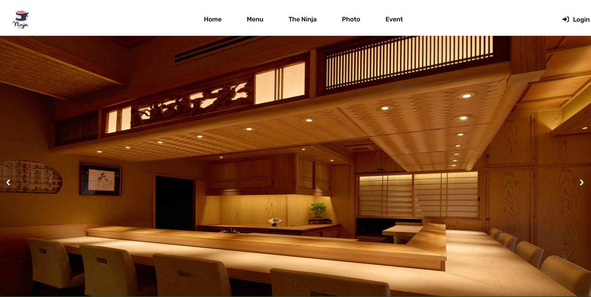

<h1> Welcome to Ninja Sushi !</h1>

Hi, I'm Muhammad Afif F Fikri, this is Milestone 1, i know it can still improved and will be update soon!

## STRUCTURE 📰
- Header
  - Navbar
  - Carousel
- Main
  - about-us Section
  - our-menu Section
  - our-location Section
  - reservation Section

## INGREDIENTS I USE 📜
- HTML
- CSS

## HOW TO SET UP 📰
You will need a github account to clone this repository, make sure you're connected to github.

1. Clone this repository
```
git clone https://github.com/revou-fsse-3/milestone-1-Afifpip.git
```
2. Develop & modify the website with your personal information, once it's done you will need to push it.
```
git add .
git commit -m "update message" // make sure to give details commit message to get better logs
git push origin develop 
```
3. Once you're done, you can merge into main/master branch for production build.
```
git checkout main
git pull origin main // pull the latest version before commit merge
git merge develop // if there are any conflicts, you should resolve them manually
git commit -m "Merge develop into main"
git push origin main
```

## DEPLOYMENT  ⚙️
The project has been successfully deployed using Netlify. You can access the production version of the website by following this link: [this link](https://milestone-1.gopip.site/)

### Deployment status :
[](https://app.netlify.com/sites/avicena-week5/deploys)

1. Connect your account to Netlify !

The first step to deploy in Netlify is creating a new account or use existing account. As a beginner progammer, I would prefer using GitHub account instead.

After you successfully login, you will be redirected to dashboard of Netlify app. In this scenario, you will need to import your existing project from github to netlify. Add new site -> Import existing project -> Connect via GitHub

2. Auto Deploy with Netlify !

One of the benefit using your GitHub account connected to Netlify is that you don't have to worry about re-deploying your project manually, once there are changes that have been pushed in your repository, it will automatically re-deployed by Netlify within second.

3. Domain Registrar with NiagaHoster

Go to [https://niagahoster.co.id](https://niagahoster.co.id) and log in or create a new account. Check available domain that you wanted and make it yours.

4. Modify your project with previous customize domain !

You're on the final step to bringing live your project with previous domain.

5. Congratulations, You're done !

You should wait within 1x24 hours to let the NiagaHoster